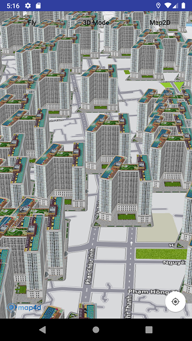

# Building Overlay

Building overlay là một loại overlay cho phép người dùng hiển thị các building từ nhiều nguồn khác nhau lên bản đồ, kết
hợp với building sẵn có của Map4D. Building overlay chỉ hiển thị ở chế độ 3D.



## Add Building overlay

Để thêm 1 Building Overlay vào map cần tạo một đối tượng `MFUrlBuildingProvider`. Lớp **MFUrlBuildingProvider** là lớp con của
lớp **MFBuildingProvider** và là một phần triển khai của **MFBuildingOverlay** để cung cấp thông tin của các Building trong từng
tile dựa trên một URL.

Bạn sẽ cần phải implement hai phương thức sau:
- `MFUrlBuildingProvider.getBuildingUrl(int x, int y, int zoom)` với các tham số là x, y, zoom. Phương thức này sẽ trả về
là một **String** chứa dữ liệu của tất cả các Building có trong tile đó.

- `MFUrlBuildingProvider.parserBuildingData(String data)` với tham số là một **String** chứa dữ liệu của tất cả các Building
và giá trị trả về là một `List<MFBuildingData>`. Dữ liệu được truyền vào phương thức này là kết quả trả về của phương
thức `MFUrlBuildingProvider.getBuildingUrl()`

Vậy để thêm một **Building Overlay** vào Map thì trước hết bạn phải có dữ liệu của Building cho các tile được xác định với
tọa độ x, y và mức zoom tương ứng. Sau đó bạn thêm **Building Overlay** vào Map như sau:

1. Tạo một đối tượng `MFUrlBuildingProvider` để cung cấp dữ liệu Building cho các tile.
2. Override phương thức `getBuildingUrl()` để trả về URL của dữ liệu Building cho từng tile tương ứng và phương thức `parserBuildingData()`
để biến đổi dữ liệu Building từ `String` sang `List<MFBuildingData>`
3. Cung cấp một đối tượng `MFBuildingOverlayOptions` với các tùy chọn:

    1. `buildingProvider(MFBuildingProvider)` : truyền vào một đối tượng MFUrlBuildingProvider được tạo ở trên sử dụng cho Building Overlay.
    
    2. `prefixId(String)` : xác định prefixId cho Building Overlay. Nó sẽ thêm tiền tố này vào id của tất cả các Building trong Building Overlay

    3. `visible(boolean)` : cho phép Building Overlay ẩn hay hiện sau khi add vào Map.

4. Gọi `Map4D.addBuildingOverlay()` để thêm Building Overlay vào Map.

<!-- tabs:start -->
#### ** Java **

```java
private Map4D map4D;

MFBuildingProvider buildingProvider = new MFUrlBuildingProvider() {
    @Override
    public String getBuildingUrl(int x, int y, int zoom) {
        return "https://poi-random.herokuapp.com/poi/" + zoom + "/" + x + "/" + y;
    }

    @Override
    public List<MFBuildingData> parserBuildingData(String data) {
        JSONObject obj;
        List<MFBuildingData> buildings = new ArrayList<>();
        try {
            obj = new JSONObject(data);
            JSONArray pois = obj.getJSONArray("pois");
            for (int i = 0; i <  pois.length(); ++i) {
                JSONObject poi = pois.getJSONObject(i);
                JSONObject position = poi.getJSONObject("position");
                double lat = position.getDouble("lat");
                double lng = position.getDouble("lng");
                String id = poi.getString("id");
                String model = "model-Url";
                String texture = "texture-Url";
                MFLocationCoordinate location = new MFLocationCoordinate(lat, lng);
                MFBuildingData buildingData = new MFBuildingData(id, location, model, texture);
                buildings.add(buildingData);
            }
        } catch (JSONException e) {
            e.printStackTrace();
        }
        return buildings;
    }
};
MFBuildingOverlay buildingOverlay = map4D.addBuildingOverlay(new MFBuildingOverlayOptions().buildingProvider(buildingProvider).prefixId("buildingOverlay-"));
```

#### ** Kotlin **

```kotlin
private lateinit var map4D: Map4D

var buildingProvider: MFBuildingProvider = object : MFUrlBuildingProvider() {
    override fun getBuildingUrl(x: Int, y: Int, zoom: Int): String {
        return "https://poi-random.herokuapp.com/poi/$zoom/$x/$y"
    }

    override fun parserBuildingData(data: String): List<MFBuildingData> {
        val obj: JSONObject
        val buildings: MutableList<MFBuildingData> = ArrayList()
        try {
            obj = JSONObject(data)
            val pois = obj.getJSONArray("pois")
            for (i in 0 until pois.length()) {
                val poi = pois.getJSONObject(i)
                val position = poi.getJSONObject("position")
                val lat = position.getDouble("lat")
                val lng = position.getDouble("lng")
                val id = poi.getString("id")
                val model = "model-Url"
                val texture = "texture-Url"
                val location = MFLocationCoordinate(lat, lng)
                val buildingData = MFBuildingData(id, location, model, texture)
                buildings.add(buildingData)
            }
        } catch (e: JSONException) {
            e.printStackTrace()
        }
        return buildings
    }
}
var buildingOverlay = map4D.addBuildingOverlay(MFBuildingOverlayOptions().buildingProvider(buildingProvider).prefixId("buildingOverlay-"))
```
<!-- tabs:end -->

### Remove Building Overlay

Bạn có thể xóa Building Overlay ra khỏi Map với phương thức `MFBuildingOverlay.remove()`

<!-- tabs:start -->
#### ** Java **

```java
buildingOverlay.remove()
```

#### ** Kotlin **

```kotlin
buildingOverlay.remove()
```
<!-- tabs:end -->

### Ẩn/Hiện Building Overlay

Gọi phương thức `MFBuildingOverlay.setVisible()` để ẩn/hiện Building Overlay.
**Chú ý:** Mặc dù Building Overlay không hiển thị nhưng quá trình tải các Building vẫn diễn ra.

<!-- tabs:start -->
#### ** Java **

```java
buildingOverlay.setVisible(false)
```

#### ** Kotlin **

```kotlin
buildingOverlay.setVisible(false)
```
<!-- tabs:end -->
