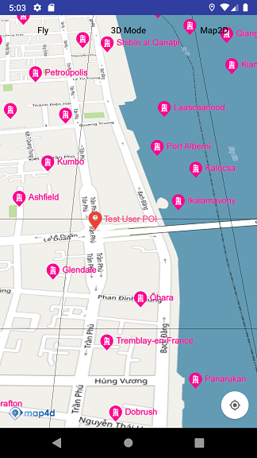

# POI Overlay

POI overlay là một loại overlay cho phép người dùng hiển thị các POI từ nhiều nguồn khác nhau lên bản đồ. Các POI của
POI Overlay được ưu tiên hiển thị so với POI của Map4D và chỉ hiển thị ở chế độ 2D.



## Add POI overlay

Để thêm 1 POI Overlay vào map cần tạo một đối tượng `MFUrlPOIProvider`. Lớp **MFUrlPOIProvider** là lớp con của
lớp **MFPOIProvider** và là một phần triển khai của **MFPOIOverlay** để cung cấp thông tin của các POI trong từng tile dựa
trên một URL.

Bạn sẽ cần phải implement hai phương thức sau:
- `MFUrlPOIProvider.getPOIUrl(int x, int y, int zoom, boolean _3dMode)` với các tham số là x, y, zoom và chế độ 3D của Map.
Phương thức này sẽ trả về là một **String** chứa dữ liệu của tất cả các POI có trong tile đó.

- `MFUrlPOIProvider.parserPOIData(String data)` với tham số là một **String** chứa dữ liệu của tất cả các POI và giá trị
trả về là một `List<MFPOIData>`. Dữ liệu được truyền vào phương thức này là kết quả trả về của phương thức `MFUrlPOIProvider.getPOIUrl()`

Vậy để thêm một **POI Overlay** vào Map thì trước hết bạn phải có dữ liệu của POI cho các tile được xác định với tọa độ x, y và mức
zoom tương ứng. Sau đó bạn thêm **POI Overlay** vào Map như sau:

1. Tạo một đối tượng `MFUrlPOIProvider` để cung cấp dữ liệu POI cho các tile.
2. Override phương thức `getPOIUrl()` để trả về URL của dữ liệu POI cho từng tile tương ứng và phương thức `parserPOIData()`
để biến đổi dữ liệu POI từ `String` sang `List<MFPOIData>`
3. Cung cấp một đối tượng `MFPOIOverlayOptions` với các tùy chọn:

    1. `poiProvider(MFPOIProvider)` : truyền vào một đối tượng MFUrlPOIProvider được tạo ở trên sử dụng cho POI Overlay.
    
    2. `prefixId(String)` : xác định prefixId cho POI Overlay. Nó sẽ thêm tiền tố này vào id của tất cả các POI trong POI Overlay

    3. `visible(boolean)` : cho phép POI Overlay ẩn hay hiện sau khi add vào Map.

4. Gọi `Map4D.addPOIOverlay()` để thêm POI Overlay vào Map.

<!-- tabs:start -->
#### ** Java **

```java
private Map4D map4D;

MFPOIProvider poiProvider = new MFUrlPOIProvider() {
    @Override
    public String getPOIUrl(int x, int y, int zoom, boolean _3dMode) {
        return "https://poi-random.herokuapp.com/poi/" + zoom + "/" + x + "/" + y;
    }

    @Override
    public List<MFPOIData> parserPOIData(String data) {
        JSONObject obj;
        List<MFPOIData> list = new ArrayList<>();
        try {
            obj = new JSONObject(data);
            JSONArray pois = obj.getJSONArray("pois");
            for (int i = 0; i <  pois.length(); ++i) {
                JSONObject poi = pois.getJSONObject(i);
                String id = poi.getString("id");
                String title = poi.getString("title");
                JSONObject position = poi.getJSONObject("position");
                double lat = position.getDouble("lat");
                double lng = position.getDouble("lng");
                MFPOIData poiData = new MFPOIData(id, title, new MFLocationCoordinate(lat, lng));
                list.add(poiData);
            }
        } catch (JSONException e) {
            e.printStackTrace();
        }
        return list;
    }
};
MFPOIOverlay poiOverlay = map4D.addPOIOverlay(new MFPOIOverlayOptions().poiProvider(poiProvider).prefixId("poiOverlay-"));
```

#### ** Kotlin **

```kotlin
private lateinit var map4D: Map4D

var poiProvider: MFPOIProvider = object : MFUrlPOIProvider() {
    override fun getPOIUrl(x: Int, y: Int, zoom: Int, _3dMode: Boolean): String {
      return "https://poi-random.herokuapp.com/poi/$zoom/$x/$y"
    }

    override fun parserPOIData(data: String): List<MFPOIData> {
        val obj: JSONObject
        val list: MutableList<MFPOIData> = ArrayList()
        try {
            obj = JSONObject(data)
            val pois = obj.getJSONArray("pois")
            for (i in 0 until pois.length()) {
                val poi = pois.getJSONObject(i)
                val id = poi.getString("id")
                val title = poi.getString("title")
                val position = poi.getJSONObject("position")
                val lat = position.getDouble("lat")
                val lng = position.getDouble("lng")
                val poiData = MFPOIData(id, title, MFLocationCoordinate(lat, lng))
                list.add(poiData)
            }
        } catch (e: JSONException) {
            e.printStackTrace()
        }
        return list
    }
}
var poiOverlay = map4D.addPOIOverlay(MFPOIOverlayOptions().poiProvider(poiProvider).prefixId("poiOverlay-"))
```
<!-- tabs:end -->

### Remove POI Overlay

Bạn có thể xóa POI Overlay ra khỏi Map với phương thức `MFPOIOverlay.remove()`

<!-- tabs:start -->
#### ** Java **

```java
poiOverlay.remove()
```

#### ** Kotlin **

```kotlin
poiOverlay.remove()
```
<!-- tabs:end -->

### Ẩn/Hiện POI Overlay

Gọi phương thức `MFPOIOverlay.setVisible()` để ẩn/hiện POI Overlay.  
**Chú ý:** Mặc dù POI Overlay không hiển thị nhưng quá trình tải các POI vẫn diễn ra.

<!-- tabs:start -->
#### ** Java **

```java
groundOverlay.setVisible(false)
```

#### ** Kotlin **

```kotlin
groundOverlay.setVisible(false)
```
<!-- tabs:end -->
