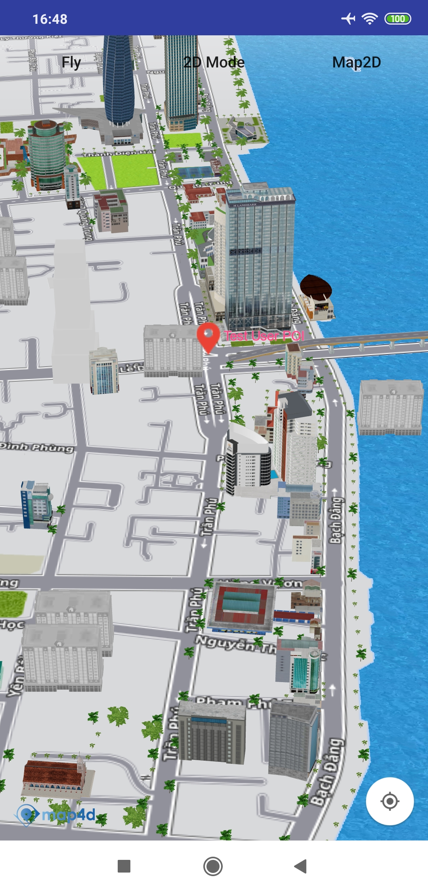

# POI

Hiện tại trên bản đồ đã có những điểm đánh dấu địa điểm có sẵn (như địa danh công cộng, quán cà phê, nhà hàng, bến xe, ...)
và chúng chỉ hiển thị khi bản đồ ở chế độ 2D. Khi bạn cần một đối tượng để đánh dấu một địa điểm trên bản đồ tương tự như
những điểm có sẵn đó thì bạn có thể dùng lớp **MFPOI**. Các đối tượng **MFPOI** bạn thêm vào bản đồ có thể hiển thị
ở **cả 2 chế độ 2D và 3D**. 

### 1. MFPOI & MFPOIOptions

```java
public final class MFPOIOptions {

    private MFLocationCoordinate position;

    private String title;

    private String subtitle;

    private String type;

    @ColorInt
    private int titleColor;

    private MFBitmapDescriptor icon;

    private View iconView;

    private float zIndex;

    private Object userData;

    private boolean visible;

    private boolean touchable;
}

public final class MFPOI extends Annotation {

    private static final float Z_INDEX = 1.0f;

    private String placeId;

    private MFLocationCoordinate position;

    private String title;

    private String subtitle;

    private String type;

    @ColorInt
    private int titleColor;

    private MFBitmapDescriptor icon;

    private View iconView;

    private boolean visible;

    private boolean touchable;
}
```

Các thuộc tính của **MFPOIOptions** :
- **position** : chỉ định một **MFLocationCoordinate** để xác định vị trí ban đầu của POI.
- **title** : chỉ định tiêu đề của POI. Tiêu đề sẽ hiển thị thông tin của POI mà bạn muốn hiển thị cho người dùng.
- **subtitle** : chỉ định thông tin mô tả của POI.
- **type** : chỉ định kiểu của POI, tùy thuộc vào kiểu mà icon của POI sẽ có hình ảnh tương ứng. Hiện tại **map4d**
hỗ trợ cái kiểu sau: **point, cafe, bus_station, electronics, shop, bakery, fuel, restaurant, police, payment_centre, museum,
university, school, airport, bank, clothes, motel, insurance, furniture, atm, hospital, bar, books, theatre, car, goverment,
townhall, apartment, park, stadium, nightclub**. Kiểu mặc định sẽ là **point**.
- **titleColor** : chỉ định màu tiêu đề của POI theo kiểu *ColorInt*. Giá trị mặc định là **Color.BLUE**
- **icon** : chỉ định icon kiểu MFBitmapDescriptor cho Marker. Nếu icon == null thì lấy marker mặc định.
- **iconView**: Truyền **custom view** cho POI. Nếu iconView != null thì iconView sẽ thay thế icon.
- **zIndex** : chỉ định thứ tự hiển thị giữa các POI với nhau, nó không dùng để xác định thứ tự hiển thị
so với các đối tượng khác. Giá trị mặc định là **1.0f**.
- **visible** : xác định POI có thể ẩn hay hiện trên bản đồ. Giá trị mặc định là **true**.
- **touchable** : cho phép người dùng có thể tương tác với POI trên bản đồ hay không. Giá trị mặc định là **true**

### 2. Tạo POI

 
  
<!-- tabs:start -->
#### ** Kotlin **
```kotlin
val userPOIOptions = MFPOIOptions()
    userPOIOptions.position(MFLocationCoordinate(16.066517, 108.210354)).title("Test User POI")
      .titleColor(Color.GREEN)
      .subtitle("Da Nang")
    val poi = map4D.addPOI(userPOIOptions)
```

#### ** Java **
```java
  MFPOIOptions userPOIOptions = new MFPOIOptions();
  userPOIOptions.position(new MFLocationCoordinate(16.071876, 108.223994)).title("Test User POI")
    titleColor(Color.GREEN).subtitle("Da Nang");
  MFPOI poi = map4D.addPOI(userPOIOptions);
```
<!-- tabs:end -->
 - **Chú ý**:
 - Người dùng có thể set icon cho POI bằng các cách sau (theo thứ tự ưu tiên):
   - ***Tuỳ biến lại marker bằng cách dùng hàm setIconView***
   - ***Sử dụng 1 hình ảnh làm icon dùng hàm setIcon***
   - ***Set type cho POI***
   
### 3. Xóa POI khỏi bản đồ

Để xóa một POI ra khỏi bản đồ, hãy gọi phương thức **remove()**

<!-- tabs:start -->
#### ** Kotlin **
```kotlin
    poi.remove()
```
#### ** Java **
```java
poi.remove();
```
<!-- tabs:end -->

### 3. Bật, tắt tính năng POI có sẵn của bản đồ

Bạn có thể bật hoặc tắt tính năng POI có sẵn của bản đồ. Mặc định thì bản đồ sẽ hiển thị các POI có sẵn của nó. Nếu bạn
muốn tắt nó đi thì sử dụng phương thức **setPOIsEnabled()** của lớp **Map4D** và truyền vào tham số **false**. Ngược
lại nếu bạn muốn bật nó lên thì bạn truyền vào tham số là **true**.

Ví dụ để tắt tính năng POI có sẵn của bản đồ:

<!-- tabs:start -->

#### ** Kotlin **
```kotlin
map4D?.setPOIsEnabled(false)
map4D?.isPOIsEnabled = false
```
#### ** Java **
```javascript
map4D.setPOIsEnabled(false);
```
<!-- tabs:end -->
Ngoài ra để kiểm tra tính năng POI có sẵn có được bật hay không bạn cũng có thể sử dụng phương thức **isPOIsEnabled()**
của lớp **Map4D**. Phương thức này sẽ trả về một giá trị **boolean** tương ứng với tính năng có được bật hay không.

<!-- tabs:start -->
#### ** Kotlin **
```kotlin
if (!map4D?.isPOIsEnabled) {
  Toast.makeText( context,
    "Poi is turn off",
    Toast.LENGTH_SHORT
  ).show()
}
```
#### ** Java **
```java
boolean isPOIsEnabled = map4D.isPOIsEnabled();
if (!isPOIsEnabled) {
  Toast.makeText( context,
    "Poi is turn off",
    Toast.LENGTH_SHORT
  ).show();
}
```
<!-- tabs:end -->

### 4. Hiển thị POI theo filter

Đôi lúc bạn không muốn hiển thị tất cả các POI mặc định của bản đồ mà chỉ muốn hiển thị theo một số type mà bạn muốn.
Phương thức **setFilterPlaces()** của lớp **Map4D** sẽ giúp bạn thực hiện điều đó. Bạn cần truyền một mảng string chứa các
**type** mà bạn muốn hiển thị trên bản đồ (các **type** này bạn có thể xem lại ở thuộc tính **type** của **MFPOIOptions**
ở mục **1**).

Ví dụ: Để cho phép bản đồ chỉ hiển thị những POI có type là **cafe**, **bank** và **atm**

<!-- tabs:start -->
#### ** Kotlin **
```kotlin
map4D?.filterPlaces = listOf("cafe", "bank", "atm")
```
#### ** Java **
```java
map4D.setFilterPlaces(new ArrayList(Arrays.asList("cafe", "bank", "atm")));
```
<!-- tabs:end -->

Nếu bạn gọi phương thức **setFilterPlaces()** nhiều lần thì mảng danh sách mà bạn set cuối cùng sẽ được filter.

Để hiển thị lại tất cả các POI mặc định của bản đồ mà không filter thì bạn có thể gọi lại phương thức **setFilterPlaces()**
với tham số truyền vào là một một danh sách rỗng.

Ví dụ:

<!-- tabs:start -->
#### ** Koltin **
```kotlin
map4D?.filterPlaces = listOf()
```

#### ** Java **
```java
map4D.setFilterPOIs(new ArrayList())
``` 
<!-- tabs:end -->

Để kiểm tra các **type** nào đang được filter bạn có thể sử dụng phương thức **getFilterPlaces()** của lớp Map. Phương
thức này sẽ trả về một mảng string chứa các **type**

Ví dụ:

<!-- tabs:start -->
#### ** Kotlin **
```kotlin
val filterTypes = map4D?.filterPlaces
```
#### ** Java **
```java
let filterTypes = map.getFilterPOIs()
```
<!-- tabs:end -->


## 3. Sự kiện click POI

> Poi có 2 loại là của người dùng thêm vào và có sẵn trên bản đồ.

- Phát sinh khi người dùng click vào POI mà user thêm vào

<!-- tabs:start -->
#### ** Kotlin **
```kotlin
map4D?.setOnUserPOIClickListener {poi ->
    Toast.makeText(context, "User Poi Clicked: ${poi.title}", Toast.LENGTH_SHORT).show()
}
```

#### ** Java **
```java
map4D.setOnUserPOIClickListener(new Map4D.OnUserPOIClickListener() {
    @Override
    public void onUserPOIClick(MFPOI mfpoi) {
        Toast.makeText(context , "User Poi Clicked: " + mfpoi.getTitle(), Toast.LENGTH_SHORT).show();
    }
});
```
<!-- tabs:end -->

- Phát sinh khi người dùng click vào POI mà user thêm vào

<!-- tabs:start -->
#### ** Kotlin **
```kotlin
map4D?.setOnPOIClickListener { placeId, title, mfLocationCoordinate ->
    Toast.makeText(context, "Poi Clicked: $title", Toast.LENGTH_SHORT).show()
}
```

#### ** Java **
```java
map4D.setOnPOIClickListener(new Map4D.OnPOIClickListener() {
    @Override
    public void onPOIClick(String placeId, String title, MFLocationCoordinate location) {
        Toast.makeText(context , "Poi Clicked: " + title, Toast.LENGTH_SHORT).show();
    }
});
<!-- tabs:end -->