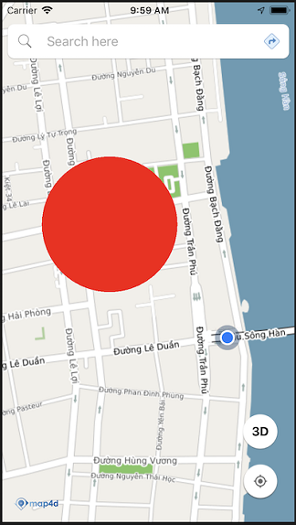
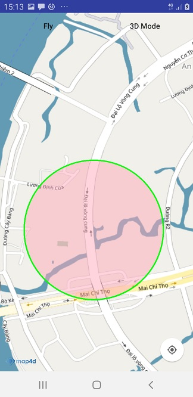

# Circle

Lớp Circle cho phép người dùng vẽ một Circle lên map..

### 1. Circle & CircleOptions

```java
public class MFCircleOptions {
	private MFLocationCoordinate center; // Tâm của Circle 
	private double radius; // Bán kính Circle (Đơn vị: m)
	@ColorInt
	private int fillColor; // Màu sắc Circle
	@ColorInt
	private int strokeColor; // Màu sắc đường viền của Circle
	private float strokeWidth; // độ rộng của đường viền của Circle
	private boolean touchabble; // Circle có thể touch được hay không
	private boolean visible; // Ẩn hoặc hiện Circle
	private float zIndex; // thứ tự vẽ circle
	
	public MFCircleOptions();
	public MFCircleOptions center(MFLocationCoordinate center); // set vị trí tâm
	public MFCircleOptions radius(double radius); // set bán kính
	public MFCircleOptions fillColor(String color); // @Deprecate, set màu sắc
	public MFCircleOptions fillColor(@ColorInt int color); // set màu sắc
	public MFCircleOptions strokeColor(@ColorInt int color); // set màu sắc đường viền Circle
	public MFCircleOptions strokeWidth(float width); // set độ rộng đường viền Circle
	public MFCircleOptions fillAlpha(float alpha); // @Deprecate, set độ trong suốt
	public MFCircleOptions visible(boolean visible); // set ẩn hoặc hiện circle
	public MFCircleOptions touchable(boolean touchable); // Cài đặt circle touch được hay không
	public MFCircleOptions zIndex(float zIndex); // cài đặt thứ tự vẽ circle trên map
	public MFLocationCoordinate getCenter();  // lấy vị trí tâm
	public double getRadius(); // lấy bán kính
	@ColorInt
	public int getFillColor(); // lấy màu sắc của Circle
	@ColorInt
	public int getStrokeColor(); // lấy màu sắc của đường viền Circle
	public float getStrokeWidth(); // lấy độ rộng của đường viền Circle
	public float isTouchable(); // kiểm tra Circle có touch được hay không
	
	public boolean isVisible(); // kiểm tra ẩn hiện
	public float getZIndex(); // lấy giá trị của zIndex
}

public class MFCircle extends Annotation {
    public MFCircle(@NonNull MFCircleOptions circleOptions,
                    @NonNull AnnotationDelegate annotationDelegate);
    public MFLocationCoordinate getCenter(); // lấy điểm tâm
    public double getRadius(); // lấy bán kính
    public void setRadius(double radius); // set bán kính
    public void setCenter(MFLocationCoordinate center); // set vị trí tâm
    @ColorInt
    public int getFillColor(); // lấy color
    public boolean isVisible(); // kiểm tra circle đang ẩn hoặc hiện
    public void setFillColor(@NonNull String color); //@Deprecate, set màu của circle
    public void setFillColor(@Color int color); //@Deprecate, set màu của circle
    public void setStrokeColor(@Color int color); // set màu đường viền của circle
    public void setStrokeWidth(float color); // set độ rộng đường viền của circle
    public void setFillAlpha(float alpha); // @Deprecate, set độ trong suốt
    public void setVisible(boolean visible); // ẩn hoặc hiện circle
    public void setTouchable(boolean touchable); // Cài đặt Circle có touch được hay không
    public boolean isTouchable(); // Cài đặt Circle có touch được hay không
    public void remove(); // remove circle khỏi map
}
```

Các thuộc tính của **CircleOptions** :

- **center** : một điểm tọa độ **MFLocationCoordinate** để xác định tâm của Circle.
- **radius** : chỉ định bán kính của Circle theo đơn vị **mét**.
- **fillColor** : chỉ định màu sắc của Circle theo kiểu **ColorInt** . Giá trị mặc định là **Color.RED**.
- **strokeColor** : chỉ định màu sắc của **đường viền Circle** theo kiểu **ColorInt**. Giá trị mặc
định là **Color.BLACK**.
- **strokeWidth** : chỉ định độ lớn của **đường viền Circle** theo đơn vị **point**.
- **visible** : xác định Circle có thể ẩn hay hiện trên bản đồ. Giá trị mặc định là **true**.
- **touchabble** : cho phép người dùng có thể tương tác với circle hay không. Giá trị mặc định là **true**.
- **zIndex** : chỉ định thứ tự hiển thị giữa các Circle với nhau hoặc giữa Circle với các đối tượng khác trên
bản đồ. Giá trị mặc định là **-1.0f**.

### 2. Tạo circle



- Tạo circle from MFCircleOptions 

<!-- tabs:start -->
#### ** Kotlin **
```kotlin
 val circle = map4D.addCircle(MFCircleOptions()
                        .center(MFLocationCoordinate(16.066517, 108.210354))
                        .radius(500)
                        .fillColor(ContextCompat.getColor(this, R.color.redWithAlphaThirtyPercent)))
```
#### ** Java **
```java
 MFCircle circle = map4D.addCircle(new MFCircleOptions()
                        .center(new MFLocationCoordinate(16.066517, 108.210354))
                        .radius(500)
                        .fillColor(ContextCompat.getColor(this, R.color.redWithAlphaThirtyPercent)));
```
<!-- tabs:end -->

Như ví dụ trên thì chúng ta tạo một Circle với các tùy chỉnh như sau:
* Tâm của Circle ở tọa độ `MFLocationCoordinate (LatLng)`: 16.066517, 108.210354
* Bán kính của Circle là: 500 mét
* Màu của Circle là: #4D00ff00, 4D là giá trị alpha

- Tạo circle với strokeColor and strokeWidth.



<!-- tabs:start -->
#### ** Kotlin **
```kotlin
 val circle = map4D.addCircle(MFCircleOptions()
                        .center(MFLocationCoordinate(16.066517, 108.210354))
                        .radius(300.0)
                        .fillColor(ContextCompat.getColor(context ?: return, R.color.green))
                        .strokeWidth(5.0f)
                        .strokeColor(ContextCompat.getColor(this ?: return, R.color.red)))
```

#### ** Java **
```java
 java circle = map4D.addCircle(new MFCircleOptions()
                        .center(new MFLocationCoordinate(16.066517, 108.210354))
                        .radius(300)
                        .fillColor(ContextCompat.getColor(this, R.color.green))
                        .strokeWidth(5.f)
                        .strokeColor(ContextCompat.getColor(this, R.color.red)));
```

<!-- tabs:end -->
**Lưu ý:**

   - Stroke width đơn vị là point tương đương dp trong android
   - Stroke width mặc định là 0.f (không vẽ)
   
### 3. Xóa Circle

> Để xóa Circle ra khỏi bản đồ ta sử dụng hàm `remove()`

<!-- tabs:start -->
#### ** Kotlin **
```kotlin
 circle.remove()
```

#### ** Java **
```java
circle.remove();
```
<!-- tabs:end -->

### 4. Sự kiện click circle

Phát sinh khi người dùng click vào circle, mặc circle có thể click được (touchable).

<!-- tabs:start -->
#### ** Kotlin **
```kotlin
map4D?.setOnCircleClickListener { mfCircle ->
      Toast.makeText(context, "Circle clicked:  ${mfCircle.id}", Toast.LENGTH_SHORT).show()
    }
```
#### ** Java **
```java
map4D.setOnCircleClickListener(new Map4D.OnCircleClickListener() {
    @Override
    public void onCircleClick(MFCircle mfCircle) {
        Toast.makeText(getApplicationContext(), "Circle clicked:  " + mfCircle.getId(), Toast.LENGTH_SHORT).show();
    }
});
```
<!-- tabs:end -->

> Tham số mfCircle sẽ trả về đối tượng Circle mà người dùng click vào

## 5. Thứ tự vẽ các layer

- Giá trị default zIndex của Circle nếu người dùng không truyền vào là -1.f
- zIndex: Circle nào có zIndex lớn hơn sẽ ưu tiên hiển thị trước, zIndex càng lớn càng sẽ được vẽ sau.

<!-- tabs:start -->
#### ** Kotlin **
```kotlin
  val circleA = map4D.addCircle(MFCircleOptions()
                          .center(MFLocationCoordinate(16.066517, 108.210354))
                          .radius(500.0)
                          .fillColor(ContextCompat.getColor(context ?: return, R.color.green))
                          .zIndex(10.0f))
  val circleB = map4D.addCircle(MFCircleOptions()
                          .center(MFLocationCoordinate(16.066517, 108.210354))
                          .radius(500.0)
                          .fillColor(ContextCompat.getColor(context ?: return, R.color.red))
                          .zIndex(2.0f))
```

#### ** Java **
```java
  MFCircle circleA = map4D.addCircle(new MFCircleOptions()
                          .center(new MFLocationCoordinate(16.066517, 108.210354))
                          .radius(500)
                          .fillColor(ContextCompat.getColor(this, R.color.green))
                          .zIndex(10.f));
  MFCircle circleB = map4D.addCircle(new MFCircleOptions()
                          .center(new MFLocationCoordinate(16.066517, 108.210354))
                          .radius(500)
                          .fillColor(ContextCompat.getColor(this, R.color.red))
                          .zIndex(2.f));
```

<!-- tabs:end -->
- CircleA sẽ được vẽ đè lên vì zIndex của nó lớn hơn zIndex của circleB.

<!-- tabs:start -->

#### ** Kotlin **
```java
  MFCircle circleA = map4D.addCircle(new MFCircleOptions()
                            .center(new MFLocationCoordinate(16.066517, 108.210354))
                            .radius(500)
                            .fillColor(ContextCompat.getColor(this, R.color.red)));
  MFCircle circleB = map4D.addCircle(new MFCircleOptions()
                            .center(new MFLocationCoordinate(16.066517, 108.210354))
                            .radius(500)
                            .fillColor(ContextCompat.getColor(this, R.color.green)));
```
#### ** Java **
```java
  MFCircle circleA = map4D.addCircle(new MFCircleOptions()
                            .center(new MFLocationCoordinate(16.066517, 108.210354))
                            .radius(500)
                            .fillColor(ContextCompat.getColor(this, R.color.red)));
  MFCircle circleB = map4D.addCircle(new MFCircleOptions()
                            .center(new MFLocationCoordinate(16.066517, 108.210354))
                            .radius(500)
                            .fillColor(ContextCompat.getColor(this, R.color.green)));
```

<!-- tabs:end -->
- CircleB sẽ vẽ đè lên CircleA vì nó có zIndex bằng nhau. Cùng zIndex thì layer nào thêm vào sau sẽ vẽ đè lên layer trước.
