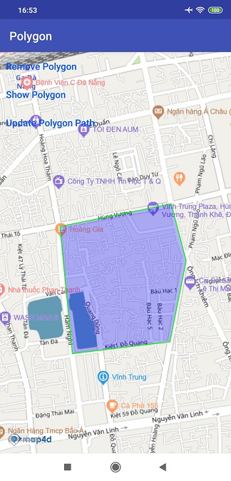

# Polygon
Lớp Polygon cho phép người dùng vẽ một Polygon lên map.

## 1. Polygon & PolygoneOptions

```java
public class MFPolygonOptions {
    private List<MFLocationCoordinate> points; // Danh sách các toạ độ cần vẽ
    private List<List<MFLocationCoordinate>> holes; // Danh sách các tọa độ holes
    private @ColorInt fillColor;  // màu sắc của polygon
    private boolean visible;  // ẩn/hiển polygon
    private float zIndex;  // thứ tự vẽ polygon
    @ColorInt
    private int strokeColor; // màu của đương viền
    private float strokeWidth; // độ rộng của đường viền
    private boolean touchable; // có thể touch polygon hay ko, mặc đinh la true, có thể touch
    
    public MFPolygonOptions(); // khởi tạo 
    public MFPolygonOptions add(MFLocationCoordinate... points); //add danh sách các tọa độ cần vẽ
    public MFPolygonOptions add(MFLocationCoordinate point); // add 1 point vào danh sách tọa độ
    public MFPolygonOptions addHole(MFLocationCoordinate... points); // add danh sách tọa độ holes
    public MFPolygonOptions fillColor(String color); // @Deprecate, set màu sắc
    public MFPolygonOptions fillColor(@ColorInt int color); // set màu sắc
    public MFPolygonOptions strokeColor(@ColorInt int color); // set màu sắc của đường viền
    public MFPolygonOptions strokeWidth(float width); // set đọ rộng của đường viền
    public MFPolygonOptions alpha(float alpha); // @Deprecate, set độ trong suốt
    public MFPolygonOptions touchable(boolean touchable); // cài dặt touch cho polygon
    public MFPolygonOptions visible(boolean visible); // cho phép ẩn hiện
    public MFPolygonOptions zIndex(float zIndex); // cài đặt zIndex
    public List<MFLocationCoordinate> getPoints(); // lấy danh sách tọa độ cần vẽ
    public List<List<MFLocationCoordinate>> getHoles(); // lấy danh sách tọa đọ holes
    @ColorInt
    public int getFillColor(); // lấy màu của polygon
    @ColorInt
    public int getStrokeColor(); // lấy màu của đường viền polygon
    public int getStrokeWidth(); // lấy độ rộng của polygon
    public boolean isVisible(); // kiểm tra ẩn hiện của polygon
    public float getZindex(); // lấy giá trị của zIndex
    public boolean getTouchable(); // lấy giá trị của touchable
}

public class MFPolygon extends Annotation {
    public MFPolygon(@NonNull MFPolygonOptions polygonOptions,
                     @NonNull AnnotationDelegate annotationDelegate); // khởi tạo
    public List<MFLocationCoordinate> getPoints();  // lấy danh sách tọa độ cần vẽ
    public List<List<MFLocationCoordinate>> getHoles(); // lấy danh sách tọa đọ holes
    @ColorInt
    public int getFillColor(); // lấy màu của polygon
    @ColorInt
    public int getStrokeColor(); // lấy màu của polygon
    public float getStrokeWidth(); // lấy độ rộng của đường viền polygon
    public boolean isVisible(); // kiểm tra ẩn hiện của polygon
    public boolean isTouchable(); // kiểm tra touch được hay không của polygon
    public void setFillColor(@NonNull String color); @Deprecate, set màu sắc
    @ColorInt
    public void setFillColor(@ColorInt int color); , set màu sắc
    public void setStrokeColor(@ColorInt int color); , set màu sắc của đường viền
    public void setStrokeWidth(float color); , set độ rộng của đường viền
    public void setFillAlpha(float alpha); // @Deprecate, set độ trong suốt
    public void setVisible(boolean visible); // cho phép ẩn hiện
    public void setTouchable(boolean touchable); // cho phép touch hay ko
    public void setPoints(List<MFLocationCoordinate> points); //add danh sách các tọa độ cần vẽ
    public void setHoles(List<List<MFLocationCoordinate>> holes); // add danh sách tọa độ holes
    public void remove(); // remove polygon khỏi map
}
```

## 2. Tạo polygon



- Tạo đối tượng polygon từ PolygonOptions

```java
  private final List<MFLocationCoordinate> pointsList = new ArrayList<>();

  private void createPointsList() {
  	pointsList.add(new MFLocationCoordinate(16.066517, 108.210354));
  	pointsList.add(new MFLocationCoordinate(16.067243, 108.214077));
  	pointsList.add(new MFLocationCoordinate(16.065419, 108.214576));
  	pointsList.add(new MFLocationCoordinate(16.062815, 108.214034));
  	pointsList.add(new MFLocationCoordinate(16.062434, 108.210772));
  	pointsList.add(new MFLocationCoordinate(16.066517, 108.210354));
 }

  private void addPolygonToMap() {
	createPointsList();
	polygon = map4D.addPolygon(new MFPolygonOptions()
	        .add(pointsList.toArray(new MFLocationCoordinate[pointsList.size()]))
	        .strokeColor(ContextCompat.getColor(this, R.color.green))
            .strokeWidth(2)
	        .fillColor(ContextCompat.getColor(this, R.color.blueWithAlpha))));
	}
```

Như ví dụ trên thì chúng ta tạo một Polygon từ danh sách các điểm tọa độ trong danh sách `pointsList` . Các tùy chỉnh gồm:

* Màu cho polygon: 0000ff, giá trị alpha là 80(hex), 0.5 float

Ngoài ra chúng ta còn có thể tạo ra các Polygon có lỗ ở bên trong bằng cách thêm danh sách cái điểm tạo thành lỗ ở phía trong
polygon.


Ví dụ

```java
  private final List<MFLocationCoordinate> pointsList = new ArrayList<>();
  private final List<MFLocationCoordinate> holePath = new ArrayList<>();

  private void createPointsList() {
  	pointsList.add(new MFLocationCoordinate(16.066517, 108.210354));
  	pointsList.add(new MFLocationCoordinate(16.067243, 108.214077));
  	pointsList.add(new MFLocationCoordinate(16.065419, 108.214576));
  	pointsList.add(new MFLocationCoordinate(16.062815, 108.214034));
  	pointsList.add(new MFLocationCoordinate(16.062434, 108.210772));
  	pointsList.add(new MFLocationCoordinate(16.066517, 108.210354));
 }

  private void createHole() {
    holePath.add(new MFLocationCoordinate(16.065681, 108.211716));
    holePath.add(new MFLocationCoordinate(16.065898, 108.213009));
    holePath.add(new MFLocationCoordinate(16.065336, 108.213202));
    holePath.add(new MFLocationCoordinate(16.064965, 108.212183));
    holePath.add(new MFLocationCoordinate(16.065681, 108.211716));
  }

  private void addPolygonToMap() {
	createHole();
	createPointsList();
	polygon = map4D.addPolygon(new MFPolygonOptions()
	        .add(pointsList.toArray(new MFLocationCoordinate[pointsList.size()]))
	        .addHole(holePath.toArray(new MFLocationCoordinate[holePath.size()]))
	        .fillColor(ContextCompat.getColor(this, R.color.blueWithdAlphaFiftyPercent)));
	}
```

  ***Chú ý:***
  -  Điểm đầu điểm cuối danh sách các điểm cần vẽ phải giống nhau
  
  Xem demo ở ví dụ sau đây:
  
```java
    pointsList.add(new MFLocationCoordinate(16.066517, 108.210354));
  	pointsList.add(new MFLocationCoordinate(16.067243, 108.214077));
  	pointsList.add(new MFLocationCoordinate(16.065419, 108.214576));
  	pointsList.add(new MFLocationCoordinate(16.062815, 108.214034));
  	pointsList.add(new MFLocationCoordinate(16.062434, 108.210772));
  	pointsList.add(new MFLocationCoordinate(16.066517, 108.210354));
```

## 3. Sự kiện click polygon

Phát sinh khi người dùng click vào polygon

```java
map4D.setOnPolygonClickListener(new Map4D.OnPolygonClickListener() {
    @Override
    public void onPolygonClick(MFPolygon polygon) {
        Toast.makeText(getApplicationContext(), "Clicked Polygon: ID " + polygon.getId(), Toast.LENGTH_SHORT).show();
    }
})
```

* Tham số polygon sẽ trả về đối tượng polygon mà người dùng click vào

## 4. Xóa Polygon

Để xóa Polygon ra khỏi bản đồ ta sử dụng hàm `remove()`

```java
  polygon.remove()
```

## 5. Thứ tự vẽ các layer

- Giá trị default zIndex của Polygon nếu người dùng không truyền vào là -1.f
- zIndex: Polygon nào có zIndex lớn hơn sẽ ưu tiên hiển thị trước, zIndex càng lớn càng sẽ được vẽ sau.

```java
  private final List<MFLocationCoordinate> pointsList = new ArrayList<>();
  private final List<MFLocationCoordinate> holePath = new ArrayList<>();

  private void createPointsList() {
  	pointsList.add(new MFLocationCoordinate(16.066517, 108.210354));
  	pointsList.add(new MFLocationCoordinate(16.067243, 108.214077));
  	pointsList.add(new MFLocationCoordinate(16.065419, 108.214576));
  	pointsList.add(new MFLocationCoordinate(16.062815, 108.214034));
  	pointsList.add(new MFLocationCoordinate(16.062434, 108.210772));
  	pointsList.add(new MFLocationCoordinate(16.066517, 108.210354));
 }

  private void createHole() {
    holePath.add(new MFLocationCoordinate(16.065681, 108.211716));
    holePath.add(new MFLocationCoordinate(16.065898, 108.213009));
    holePath.add(new MFLocationCoordinate(16.065336, 108.213202));
    holePath.add(new MFLocationCoordinate(16.064965, 108.212183));
    holePath.add(new MFLocationCoordinate(16.065681, 108.211716));
  }

  private void addPolygonToMap() {
	createHole();
	createPointsList();
	MFPolygon polygonA = map4D.addPolygon(new MFPolygonOptions()
	        .add(pointsList.toArray(new MFLocationCoordinate[pointsList.size()]))
	        .addHole(holePath.toArray(new MFLocationCoordinate[holePath.size()]))
	        .fillColor(ContextCompat.getColor(this, R.color.red))
	        .zIndex(10.f));
	        
	MFPolygon polygonB = map4D.addPolygon(new MFPolygonOptions()
	        .add(pointsList.toArray(new MFLocationCoordinate[pointsList.size()]))
	        .addHole(holePath.toArray(new MFLocationCoordinate[holePath.size()]))
	        .fillColor(ContextCompat.getColor(this, R.color.blue))
	        .zIndex(2.f);
  }
```
- PolygonA sẽ được vẽ đè lên vì zIndex của nó lớn hơn zIndex của polygonB.

```java
  private final List<MFLocationCoordinate> pointsList = new ArrayList<>();
  private final List<MFLocationCoordinate> holePath = new ArrayList<>();

  private void createPointsList() {
  	pointsList.add(new MFLocationCoordinate(16.066517, 108.210354));
  	pointsList.add(new MFLocationCoordinate(16.067243, 108.214077));
  	pointsList.add(new MFLocationCoordinate(16.065419, 108.214576));
  	pointsList.add(new MFLocationCoordinate(16.062815, 108.214034));
  	pointsList.add(new MFLocationCoordinate(16.062434, 108.210772));
  	pointsList.add(new MFLocationCoordinate(16.066517, 108.210354));
 }

  private void createHole() {
    holePath.add(new MFLocationCoordinate(16.065681, 108.211716));
    holePath.add(new MFLocationCoordinate(16.065898, 108.213009));
    holePath.add(new MFLocationCoordinate(16.065336, 108.213202));
    holePath.add(new MFLocationCoordinate(16.064965, 108.212183));
    holePath.add(new MFLocationCoordinate(16.065681, 108.211716));
  }

  private void addPolygonToMap() {
	createHole();
	createPointsList();
	MFPolygon polygonA = map4D.addPolygon(new MFPolygonOptions()
	        .add(pointsList.toArray(new MFLocationCoordinate[pointsList.size()]))
	        .addHole(holePath.toArray(new MFLocationCoordinate[holePath.size()]))
	        .fillColor(ContextCompat.getColor(this, R.color.red)));
	        
	MFPolygon polygonB = map4D.addPolygon(new MFPolygonOptions()
	        .add(pointsList.toArray(new MFLocationCoordinate[pointsList.size()]))
	        .addHole(holePath.toArray(new MFLocationCoordinate[holePath.size()]))
	        .fillColor(ContextCompat.getColor(this, R.color.green)));
  }
```

- PolygonB sẽ vẽ đè lên polygonA vì nó có zIndex bằng nhau. Cùng zIndex thì layer nào thêm vào sau sẽ vẽ đè lên layer trước.

License
-------

Copyright (C) 2016 IOT Link Ltd. All Rights Reserved.
