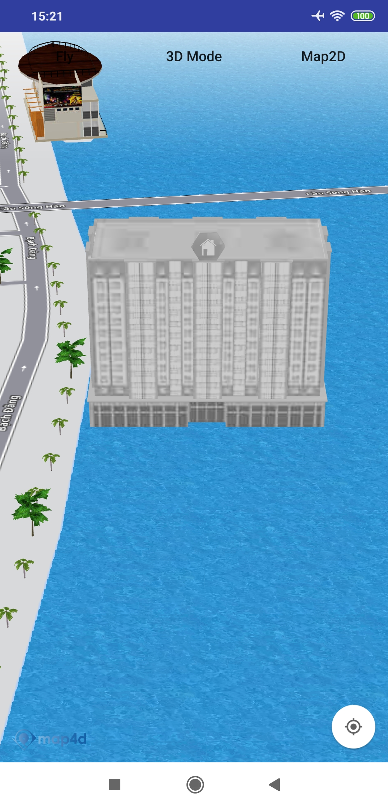

# Building
Lớp MFBuilding cho phép người dùng vẽ một building lên map.


## 1. MFBuildingOptions and MFBuilding

```java
public final class MFBuildingOptions {

    private String name;

    private MFLocationCoordinate location;

    private String model;

    private String texture;

    private List<MFLocationCoordinate> coordinates;

    private double height;

    private double scale;

    private double bearing;

    private double elevation;

    private boolean visible;

    private boolean touchable;
```

```java
public final class MFBuilding extends Annotation {

    private static final float Z_INDEX = 1.0f;

    private String buildingId;

    private String name;

    private MFLocationCoordinate location;

    private String model;

    private String texture;

    private List<MFLocationCoordinate> coordinates;

    private double height;

    private double scale;

    private double bearing;

    private double elevation;

    private List<String> places;

    private List<String> types;

    private double minZoom;

    private double maxZoom;

    private long startDate;

    private long endDate;

    private boolean selected;

    private boolean visible;

    private boolean touchable;
}
```  

- Properties:
    + name: Tên building
    + position: vị trí vẽ building
    + model: đường dẫn http chứa model của building
    + texture: đường dẫn http chứ texture của building
    + coordinates: model của building dưới dạng các coordinate (chỉ cần sử dụng một trong 2 property model hoặc coordinates để tạo building)
    + selected: set là true nếu muốn hiển thị building dưới dạng được chọn (có viền đỏ bao quanh)
    + userInteractionEnabled: cho phép building bị tác động bởi người dùng hay không, nếu building nào có userInteractionEnabled là false thì sẽ bỏ qua sự kiện click đối với building đó

## 2. Tạo Building

  -   
  
```java
     MFBuildingOptions buildingOptions = new MFBuildingOptions();
     buildingOptions.location(new MFLocationCoordinate(16.088987, 108.227940))
         .name("Test Building")
         .model("https://sw-hcm-1.vinadata.vn/v1/AUTH_d0ecabcbdcd74f6aa6ac9a5da528eb78/sdk/models/5b21d9a5cd18d02d045a5e99")
         .texture("https://sw-hcm-1.vinadata.vn/v1/AUTH_d0ecabcbdcd74f6aa6ac9a5da528eb78/sdk/textures/0cb35e1610c34e55946a7839356d8f66.jpg");
     map4D.addBuilding(buildingOptions);
```

## 3. Sự kiện click Building

  - Phát sinh khi người dùng click vào POI
  ```java
  map4D.setOnBuildingClickListener(new Map4D.OnBuildingClickListener() {
      @Override
      public void onBuildingClick(MFBuilding mfBuilding) {
          map4D.setSelectedBuildings(Arrays.asList(mfBuilding.getBuildingId()));
      }
  });

```


License
-------

Copyright (C) 2020 IOT Link Ltd. All Rights Reserved.