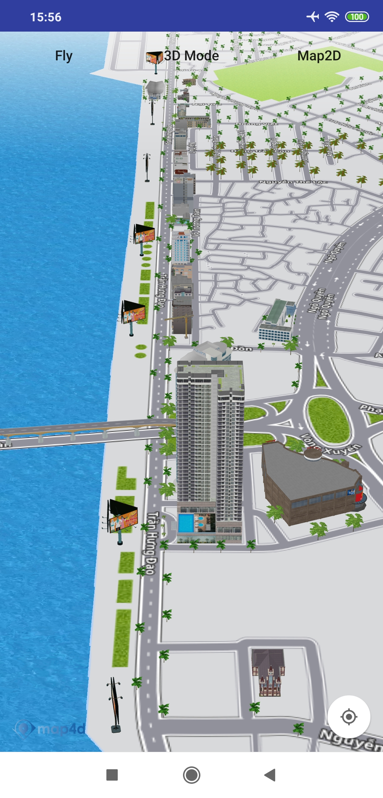

# Building Overlay
Lớp MFBuildingOverlay cho phép người dùng thêm vào các đối tượng building 3D theo tile


## 1. MFBuildingOverlay and MFBuildingOverlayOptions

```java

public interface MFBuildingProvider {
    String getTile(int x, int y, int zoom);
}

public class MFBuildingOverlayOptions {

    private MFBuildingProvider buildingProvider;

    public MFBuildingOverlayOptions() {
        buildingProvider = null;
    }

    /**
     * Set the buildingProvider for Building Overlay
     * @param buildingProvider
     * @return the object for which the method was called, with the new buildingProvider set.
     */
    public MFBuildingOverlayOptions buildingProvider(@NonNull MFBuildingProvider buildingProvider) {
        this.buildingProvider = buildingProvider;
        return this;
    }

    MFBuildingProvider getBuildingProvider() {
        return buildingProvider;
    }
}


public class MFBuildingOverlay extends MFLayerOverlay {

    private MFBuildingProvider buildingProvider;

    public MFBuildingOverlay(@NonNull MFBuildingOverlayOptions buildingOverlayOptions,
                             @NonNull LayerOverlayDelegate layerOverlayDelegate) {
        super(layerOverlayDelegate);
        this.buildingProvider = buildingOverlayOptions.getBuildingProvider();
    }

    public String getBuildingUrl(int x, int y, int z) {
        if (buildingProvider != null) {
            return buildingProvider.getTile(x, y, z);
        }
        return null;
    }
}
```

## 2. Tạo Building Overlay

  -   
  
```java
    MFBuildingOverlayOptions buildingOverlayOptions = new MFBuildingOverlayOptions().buildingProvider(new MFBuildingProvider() {
        @Override
        public String getTile(int x, int y, int zoom) {
            return "https://api.map4d.vn/sdk/tile/v2/" + zoom + "/" + x + "/" + y + "?key=98fd21346d83bee24dc734231f7609c9&mode=3d";
        }
    });
    
    MFBuildingOverlay buildingOverlay = map4D.addBuildingOverlay(buildingOverlayOptions);
```

License
-------

Copyright (C) 2020 IOT Link Ltd. All Rights Reserved.