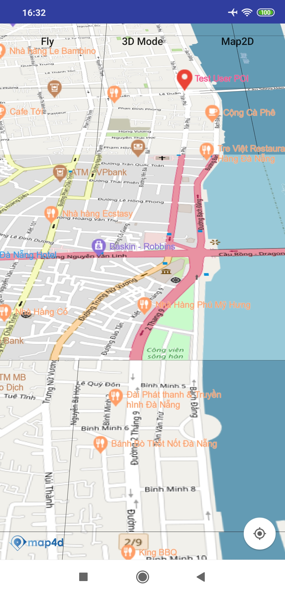

# Ground Overlay
Lớp MFGroundOverlay cho phép người dùng vẽ raster tile chồng lên map4d tile ở một khu vực nào đó


## 1. MFGroundOverlay

```java

public interface MFGroundProvider {
  String getTile(int x, int y, int zoom, boolean _3dMode);
}

public class MFGroundOverlayOptions {

  private MFGroundProvider groundProvider;

  private MFCoordinateBounds bounds;

  private String mapUrl;

  private boolean override;
}

public class MFGroundOverlay extends MFLayerOverlay {

  private MFGroundProvider groundProvider;

  private MFCoordinateBounds bounds;

  private String mapUrl;

}
```

- **override** : dùng để xác định overlay đó có được ghi đè lên map4d base map hay không, nếu có thì ở tile đó sẽ không xuất hiện poi hay building của map4d
## 2. Tạo Ground Overlay

  -   
  
```java
    MFCoordinateBounds bounds = MFCoordinateBounds.builder().includes(
      Arrays.asList(new MFLocationCoordinate(16.057814922971613, 108.22065353393553),
        new MFLocationCoordinate(16.064289641988594, 108.2324981689453))).build();

    MFGroundOverlayOptions groundOverlayOptions = new MFGroundOverlayOptions().bounds(bounds)
      .mapUrl("https://tile.openstreetmap.de/{z}/{x}/{y}.png");

    map4D.addGroundOverlay(groundOverlayOptions);
```

```java
    MFCoordinateBounds bounds = MFCoordinateBounds.builder().includes(
      Arrays.asList(new MFLocationCoordinate(16.057814922971613, 108.22065353393553),
        new MFLocationCoordinate(16.064289641988594, 108.2324981689453))).build();

    MFGroundOverlayOptions groundOverlayOptions = new MFGroundOverlayOptions().bounds(bounds).groundProvider(new MFGroundProvider() {
        @Override
        public String getTile(int x, int y, int zoom, boolean _3dMode) {
            return "https://tile.openstreetmap.de/" + zoom + "/" + x + "/" + y + ".png";
        }
    });
```

 - **Chú ý**:
   - override dùng để quy định Ground Overlay ghi đè lên map4d base map hay không
   - Nếu set override:true thì ở khu vực của ground overlay sẽ không xuất hiện map4d poi và raster

License
-------

Copyright (C) 2020 IOT Link Ltd. All Rights Reserved.