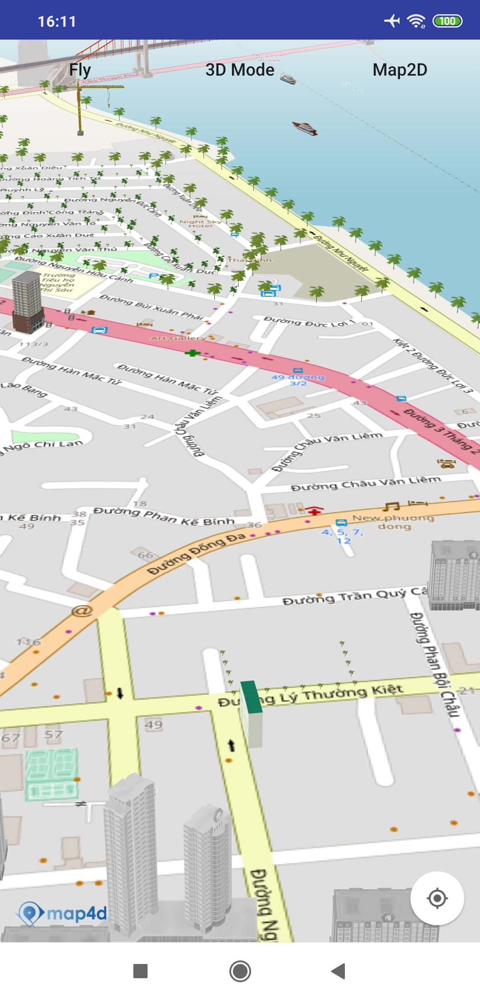

# Tile Overlay
Lớp MFTileOverlay cho phép người dùng vẽ raster tile chồng lên map4d tile


## 1. MFTileOverlay

```java
public class MFTileOverlayOptions {
    private MFTileProvider tileProvider;

    public MFTileOverlayOptions() {
        tileProvider = null;
    }

    /**
     * Set the buildingProvider for Tile Overlay
     * @param tileProvider
     * @return the object for which the method was called, with the new tileProvider set.
     */
    public MFTileOverlayOptions tileProvider(@NonNull MFTileProvider tileProvider) {
        this.tileProvider = tileProvider;
        return this;
    }

    MFTileProvider getTileProvider() {
        return tileProvider;
    }
}

public class MFTileOverlay extends MFLayerOverlay {

    private MFTileProvider tileProvider;

    public MFTileOverlay(@NonNull MFTileOverlayOptions tileOverlayOptions,
                         @NonNull LayerOverlayDelegate layerOverlayDelegate) {
        super(layerOverlayDelegate);
        this.tileProvider = tileOverlayOptions.getTileProvider();
    }

    public String getTileUrl(int x, int y, int z, boolean _3dMode) {
        if (tileProvider != null) {
            return tileProvider.getTile(x, y, z, _3dMode);
        }
        return null;
    }
}
```

## 2. MFTileProvider

```java
public interface MFTileProvider {
    String getTile(int x, int y, int zoom, boolean _3dMode);
}
```

## 3. Tạo Tile Overlay

  -   
  
```switf
  MFTileOverlayOptions tileOverlayOptions = new MFTileOverlayOptions().tileProvider(new MFTileProvider() {
      @Override
      public String getTile(int x, int y, int zoom, boolean _3dMode) {
          return "https://tile.openstreetmap.de/" + zoom + "/" + x + "/" + y + ".png";
      }
  });

  map4D.addTileOverlay(tileOverlayOptions);
```

License
-------

Copyright (C) 2020 IOT Link Ltd. All Rights Reserved.